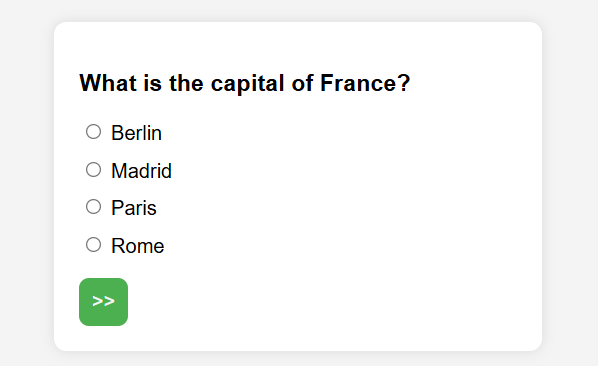

# Quiz App

A simple and interactive quiz application built with **HTML**, **CSS**, and **JavaScript**. Users can select answers, view correct answers, track their score, and restart the game at the end.

---

## Demo




### Live Demo

You can try the live version here:  
👉 [Quiz Game](https://aminbaniamer.github.io/Quiz-Game/)

---

## Features

- ✅ Multiple choice questions
- ✅ View your answer vs correct answer
- ✅ Final score display
- ✅ Restart quiz without reloading manually
- ✅ Responsive design

---

## 🚀 Getting Started

### 1. Clone the repository:

```bash
git clone https://github.com/your-username/quiz-app.git
cd quiz-app
```
